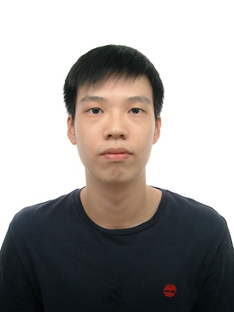
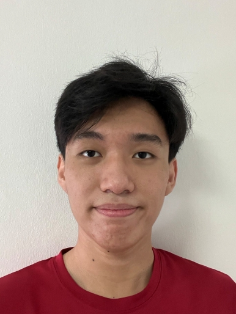

# About Us

We are a team based in the [School of Computing, National University of Singapore](http://www.comp.nus.edu.sg).

You can reach us at the email `seer[at]comp.nus.edu.sg`

## Project team

### John Doe

[[homepage](http://www.comp.nus.edu.sg/~damithch)]
[[github](https://github.com/johndoe)]
[[portfolio](team/johndoe.md)]

* Role: Project Advisor

### Clarence Lau

[[github](http://github.com/Unknownflow)]

* Role: Team Lead
* Responsibilities: UI

### Eddrick Livando

[[github](http://github.com/eddrick-23)]

* Role: Developer
* Responsibilities: Data

### Hong Yu

[[github](http://github.com/hongyuuuu)]

* Role: Developer
* Responsibilities: Dev Ops + Threading

### Nguyen Phuc Truong

[[github](https://github.com/bany-nguyen)]

* Role: Developer
* Responsibilities: UI
