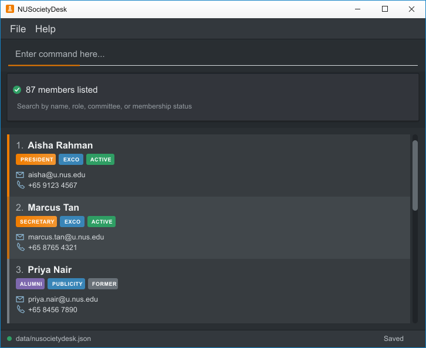

# AB-3 User Guide

AddressBook Level 3 (AB3) is a **desktop application for managing contacts, optimized for use through a Command Line Interface (CLI)** while retaining the benefits of a Graphical User Interface (GUI). If you type quickly, AB3 can help you manage contacts faster than traditional GUI applications.

<!-- * Table of Contents -->
<page-nav-print />

--------------------------------------------------------------------------------------------------------------------

## Quick start

1. Ensure that Java `25` or later is installed on your computer. 
   **Mac users:** Ensure you have the precise JDK version prescribed [here](https://se-education.org/guides/tutorials/javaInstallationMac.html).

1. Download the latest `.jar` file from [here](https://github.com/se-edu/addressbook-level3/releases).

1. Copy the file to the folder you want to use as the _home folder_ for your AddressBook.

1. Open a terminal, `cd` to the folder containing the JAR file, and run `java -jar addressbook.jar`. 
   A GUI similar to the one below should appear in a few seconds. Note how the app contains some sample data. 
   

1. Type a command in the command box and press Enter to execute it. For example, type **`help`** and press Enter to open the help window. 
   Some example commands you can try:

   * `list` : Lists all contacts.

   * `add n/John Doe p/98765432 e/johnd@example.com a/John street, block 123, #01-01` : Adds a contact named `John Doe` to the Address Book.

   * `delete 3` : Deletes the 3rd contact shown in the current list.

   * `clear` : Deletes all contacts.

   * `exit` : Exits the app.

1. Refer to the [Features](#features) section below for details of each command.

--------------------------------------------------------------------------------------------------------------------

## Features

<box type="info" seamless>

**Notes about the command format:** 

* Words in `UPPER_CASE` are the parameters to be supplied by the user. 
  For example, in `add n/NAME`, replace `NAME` with a value such as `John Doe`.

* Items in square brackets are optional. 
  For example, `n/NAME [t/TAG]` can be used as `n/John Doe t/friend` or as `n/John Doe`.

* Items followed by `...` can appear zero or more times. 
  For example, `[t/TAG]... ` may be omitted, or written as `t/friend` or `t/friend t/family`.

* Parameters can be in any order. 
  For example, if the command specifies `n/NAME p/PHONE_NUMBER`, `p/PHONE_NUMBER n/NAME` is also acceptable.

* Extraneous parameters for commands that take no parameters, such as `help`, `list`, `exit`, and `clear`, are ignored. 
  For example, `help 123` is interpreted as `help`.

* If you are using a PDF version of this document, be careful when copying and pasting commands that span multiple lines as space characters surrounding line-breaks may be omitted when copied over to the application.
</box>

### Viewing help: `help`

Shows a message explaining how to access the help page.

Format: `help`

### Adding a person: `add`

Adds a person to the address book.

Format: `add n/NAME p/PHONE_NUMBER e/EMAIL a/ADDRESS [t/TAG]... `

Email is required and uniquely identifies a member. Email addresses are compared, displayed, and saved in
lowercase. General email addresses are accepted; `@u.nus.edu` is not required. Different aliases, such as
`alex@example.com` and `alex+society@example.com`, count as different addresses. Command parsing trims
surrounding argument whitespace, but email values in the data file cannot contain surrounding whitespace.

Members may share a name or phone number if their emails differ. For example, both commands are valid:

* `add n/Alex Tan p/91234567 e/Alex.One@Example.com a/Kent Ridge`
* `add n/Alex Tan p/91234567 e/alex.two@example.com a/Clementi`

Reusing `ALEX.ONE@EXAMPLE.COM` for another member is rejected with:
`Email "alex.one@example.com" is already used by "Alex Tan". No changes were made.`
The check includes members outside the current search results.

<box type="tip" seamless>

**Tip:** A person can have any number of tags, including zero.
</box>

Tag names are alphanumeric and case-insensitive. They are stored and displayed in lowercase.
For example, `t/Publicity t/publicity` adds one tag named `publicity`.
Tags in existing saved records follow the same rule when loaded; case variants are merged.

Examples:
* `add n/John Doe p/98765432 e/johnd@example.com a/John street, block 123, #01-01`
* `add n/Betsy Crowe t/friend e/betsycrowe@example.com a/Newgate Prison p/1234567 t/criminal`

### Listing all persons: `list`

Shows a list of all persons in the address book.

Format: `list`

### Editing a person: `edit`

Edits an existing person in the address book.

Format: `edit INDEX [n/NAME] [p/PHONE] [e/EMAIL] [a/ADDRESS]`

* Edits the person at the specified `INDEX`. The index refers to the index number shown in the displayed person list. The index **must be a positive integer** 1, 2, 3, ...
* At least one of the optional fields must be provided.
* Existing values will be updated to the input values.
* Existing tags are preserved. The `edit` command rejects `t/` arguments, including an empty `t/`.
* Renaming a member or re-entering their own email is allowed. Changing their email releases the previous
  address for reuse. The new email cannot belong to another member, including one outside the displayed list.

Examples:
*  `edit 1 p/91234567 e/johndoe@example.com` Edits the phone number and email address of the 1st person to be `91234567` and `johndoe@example.com` respectively.
*  `edit 2 n/Betsy Crower` Edits the name of the 2nd person to be `Betsy Crower`.
*  `edit 2 t/` Is rejected because tags cannot be edited with `edit`. No tags are removed and the person's details remain unchanged.

### Adding a tag to a member: `tagadd`

Adds one tag to one member, preserving their other tags and contact details.

Format: `tagadd INDEX t/TAG`

* `INDEX` must be a positive integer referring to a member in the currently displayed list, including search results.
* Exactly one index and one `t/` argument are required. Empty tags, multiple tags, and extra arguments are rejected.
* Tag names must be alphanumeric. Matching is case-insensitive; tags are stored and displayed in lowercase.
* Adding a tag the member already has succeeds with the normal completion message and leaves their tags unchanged.
* After success, all members are displayed, as with `edit`. Check the displayed indices before your next command.

Example: `tagadd 1 t/Volunteer` adds `volunteer` to the first displayed member. If they already have `publicity`
and `exco`, they will have all three tags afterward.

### Removing a tag from a member: `tagremove`

Removes one matching tag from one member, preserving their other tags and contact details.

Format: `tagremove INDEX t/TAG`

* The same index, single-tag, and tag-name rules as `tagadd` apply.
* Matching is case-insensitive: `t/publicity` also matches a tag entered as `Publicity`.
* Removing a tag the member does not have succeeds with the normal completion message and leaves their tags unchanged.
* Removing the last tag is allowed and leaves the member with no tags.
* After success, all members are displayed, as with `edit`. Check the displayed indices before your next command.

Example: `tagremove 1 t/publicity` removes only `publicity` from the first displayed member. If their tags were
`publicity`, `exco`, and `volunteer`, they will retain `exco` and `volunteer`.

Both commands save changes automatically. An invalid command leaves member records and the current filter unchanged.

### Locating members by name or phone: `find`

Finds members by name keywords or a phone number substring. Matching members are displayed in a list with index numbers,
together with the number of matches.

Formats:

* `find [n/]KEYWORD [MORE_KEYWORDS]...` for name searches.
* `find p/PHONE_SUBSTRING` for phone searches.

**Name searches**

* The `n/` prefix is optional: `find Alice Bob` and `find n/Alice Bob` return the same results.
* Name matching is case-insensitive; for example, `hans` matches `Hans`.
* Keyword order does not matter; for example, `Hans Bo` matches `Bo Hans`.
* Unprefixed searches and `n/` searches consider only names.
* Only full words match; for example, `Han` does not match `Hans`.
* Members matching at least one keyword are returned (an `OR` search); for example, `Hans Bo` returns
  `Hans Gruber` and `Bo Yang`.

**Phone searches**

* The search considers only phone numbers and matches a consecutive sequence of digits anywhere in the number.
  For example, `find p/9103` matches the phone number `91031282`.
* Phone searches support only one substring. Commands such as `find p/9123 1234` are rejected with an error.
  The same applies to substrings separated by tabs or line breaks.
  Search separately with `find p/9123` and `find p/1234`.
* Both partial and full phone numbers are accepted. Even one or two digits can be used, such as `find p/9` or `find p/91`.
* Include `p/` to search phone numbers: `find 9103` searches names, while `find p/9103` searches phone numbers.

**Search rules**

* Search one field per command. Combining fields, such as `find n/Alice p/9123`, is rejected.
* Use each prefix only once. Commands such as `find n/Alice n/Bob` and `find p/9123 p/4567` are rejected.
* Provide a nonempty search value. Commands such as `find`, `find n/` and `find p/` are rejected.
* In a prefixed search, place the prefix before all search text. For example, `find Alice p/9123` is rejected.
* If no members match, the list is empty and the result count is zero.

Examples:

* `find John` returns members named `john` and `John Doe`.
* `find n/alex david` returns the same members as `find alex david`.
* `find p/9103` returns members whose phone numbers contain `9103`, including David Li in the sample data.
* `find p/91031282` returns members whose phone numbers contain the full number `91031282`.
* `find alex david` returns `Alex Yeoh`, `David Li` 
  

### Deleting a person: `delete`

Deletes the specified person from the address book.

Format: `delete INDEX`

* Deletes the person at the specified `INDEX`.
* The index refers to the index number shown in the displayed person list.
* The index **must be a positive integer** 1, 2, 3, ...

Examples:
* `list` followed by `delete 2` deletes the 2nd person in the address book.
* `find Betsy` followed by `delete 1` deletes the 1st person in the results of the `find` command.

### Clearing all entries: `clear`

Clears all entries from the address book.

Format: `clear`

### Exiting the program: `exit`

Exits the program.

Format: `exit`

### Saving the data

AddressBook automatically saves data after every command. You do not need to save manually.

### Editing the data file

AddressBook data is saved automatically as a JSON file `[JAR file location]/data/addressbook.json`. Advanced users are welcome to update data directly by editing that data file.

<box type="warning" seamless>

**Caution:**
If your changes make the data file invalid, AddressBook opens with an empty address book at the next run. This
includes files with duplicate emails that differ only in letter case. Loading alone leaves the invalid file
unchanged, but the next successful command, including `list`, saves the current in-memory address book over it.
Back up the file and correct it before running commands. 
Furthermore, certain edits can cause the AddressBook to behave in unexpected ways (e.g., if a value entered is outside of the acceptable range). Therefore, edit the data file only if you are confident that you can update it correctly.
</box>

Valid mixed-case emails appear in lowercase when loaded and are saved in lowercase after the next successful
command. Older versions of the app may reject same-name records saved by this version, so back up the data file
before switching versions.

### Archiving data files `[coming in v2.0]`

_Details coming soon ..._

--------------------------------------------------------------------------------------------------------------------

## FAQ

**Q**: How do I transfer my data to another computer? 
**A**: Install the app on the other computer and overwrite the data file it creates with the data file from your previous AddressBook home folder.

--------------------------------------------------------------------------------------------------------------------

## Known issues

1. **When using multiple screens**, if you move the application to a secondary screen, and later switch to using only the primary screen, the GUI will open off-screen. The remedy is to delete the `preferences.json` file created by the application before running the application again.
2. **If you minimize the Help Window** and then run the `help` command (or use the `Help` menu, or the keyboard shortcut `F1`) again, the original Help Window will remain minimized, and no new Help Window will appear. The remedy is to manually restore the minimized Help Window.

--------------------------------------------------------------------------------------------------------------------

## Command summary

Action     | Format, Examples
-----------|----------------------------------------------------------------------------------------------------------------------------------------------------------------------
**Add**    | `add n/NAME p/PHONE_NUMBER e/EMAIL a/ADDRESS [t/TAG]... `   e.g., `add n/James Ho p/22224444 e/jamesho@example.com a/123, Clementi Rd, 1234665 t/friend t/colleague`
**Clear**  | `clear`
**Delete** | `delete INDEX`  e.g., `delete 3`
**Edit**   | `edit INDEX [n/NAME] [p/PHONE_NUMBER] [e/EMAIL] [a/ADDRESS]`  e.g.,`edit 2 n/James Lee e/jameslee@example.com`
**Find**   | `find [n/]KEYWORD [MORE_KEYWORDS]...` or `find p/PHONE_SUBSTRING`  e.g., `find James Jake`, `find n/James Jake`, `find p/9103`
**List**   | `list`
**Add tag** | `tagadd INDEX t/TAG`  e.g., `tagadd 1 t/Volunteer`
**Remove tag** | `tagremove INDEX t/TAG`  e.g., `tagremove 1 t/publicity`
**Help**   | `help`
